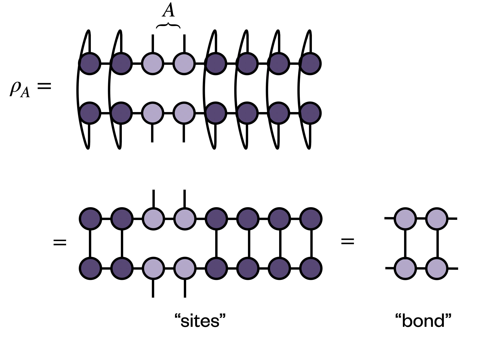

# ITensorEntropyTools.jl

A set of tools designed to compute entanglement entropy of a MPS.

## Installation
Because the package isn't registered, please install with
```julia
julia> using Pkg; Pkg.add(url="https://github.com/ryanlevy/ITensorEntropyTools.jl")
```

## Examples
Consider some MPS `p`.

The standard way to calculate the entanglement entropy would be a bipartition cut between two regions, which you get from `ee_bipartite(p, cut)`.

However, we generally want to obtain a density matrix of some `region` of sites. We can do this by tracing out all the sites or if the region is contiguous tracing out the sites leaving the bond or link dimensions. 
The function `ee_region` will somewhat automatically determine the best way to do this for you

```julia
julia> using ITensorEntropyTools

julia> ee_region(p, [2,3,4]; verbose=true)
Contiguous region found, considering sites and bond versions
Site density matrix would be size (log2) 3.0
Complement sites would be site (log2) 7.0
Bond-based density matrix would be size (log2) 4.0
Using site mode
1.5967236103088644

julia> ee_region(p, [2,3,4,5,6]; verbose=true)
Contiguous region found, considering sites and bond versions
Site density matrix would be size (log2) 5.0
Complement sites would be size (log2) 5.0
Bond-based density matrix would be size (log2) 4.0
Using bond mode
1.6807859305972712

julia> ee_region(p, [1,2,3]; verbose=true)
Using bipartite calculation for region [1, 2, 3]
1.1657496391466677
```



There is also support for generalized Renyi entropy, in case you don't want von Neumann all the time
```julia
julia> ee_region(p, [2,3,4,5,6]; ee_type=EEType("Renyi"),n=0.1)
2.033718897443242
```

> [!WARNING]
> These methods do not scale well!
> At worst, you will need to store a chi^2 x chi^2 matrix
> (or a d^L x d^L matrix) and diagonalize it.
> This library is presented as a convenient tool for small problems.

### Entropy Functions

There is support for mutual information between two regions
```math
I(A:B) = S_n(A) + S_n(B) - S_n(A\cup B)
```
```julia
julia> mutual_info_region(p,[2,3],[5,6])
0.4465377568277278
```
And tripartite mutual information
```math
I3(A:B:C) = I(A:B) + I(A:C) - I(A:BC)
```
```julia
julia> tripartite_ee_region(p,[2,3],[5,7],[8,9])
-0.5300964831614192
```

## Credits
This library was written by Ryan Levy, with heavy inspiration from prior work with Abid Khan ([@abid1214](https://github.com/abid1214)) with helpful conversations with [Bryan K Clark](https://clark.physics.illinois.edu/) and [Edgar Solomonik](https://solomonik.cs.illinois.edu/).

This library has not been rigorously tested so please report any bugs/issues you encounter! PRs and comments are also welcome 

## TODO

- [ ] Matrix Free density matrix tools
- [x] Remove dependence on tags
- [ ] combine site and link codes? 
- [x] Generalized to ITensorNetworks (see network branch)
